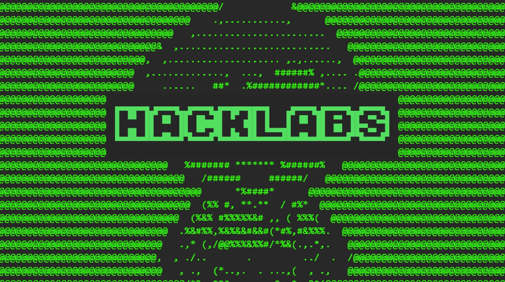
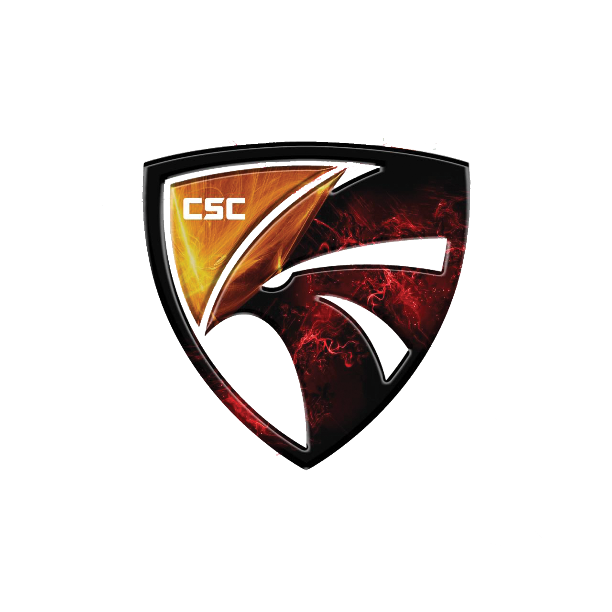
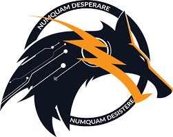

## Hi, I'm Sugiarta - aka EternalBeats

a cyber security enthusiast and likes learning anything around that as well as teaching others about what I've learned

- I'm currently a student at cyber security major
- Active player at some Capture The Flag (mostly doing Cryptography/Web Exploit challenges)
- Currently learning some skills at [HackTheBox][HTB] and [TryHackMe][THM]

### Other stuff that I do 

[][HackLabs]
Me and the boys trying to pull some new guys to the cyber world with a fun miniCTF challenges
[Github][HackLabsGit]

[][CSC]
As one of the active members and one of the mentor there

[][Petir]
A Capture The Flag team that learn intensively and competitively

[HTB]: https://www.hackthebox.eu/
[THM]: https://tryhackme.com/
[HackLabs]: https://www.instagram.com/hacklabs.id/
[HackLabsGit]: https://github.com/HackLabsId/HackLabsChall/
[CSC]: https://student-activity.binus.ac.id/csc/
[Petir]: https://petircysec.com/